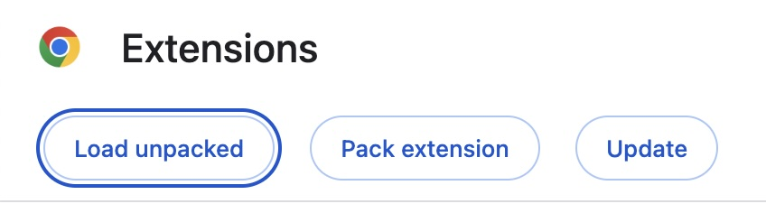
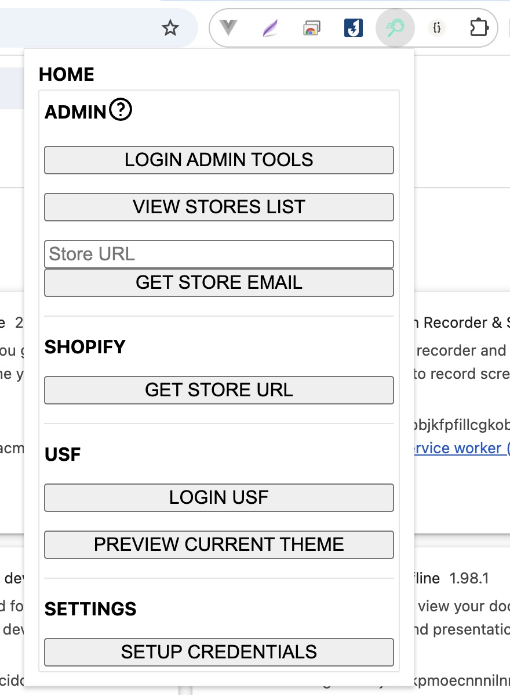

# USF TOOLING

A Chrome Extension to help with managing USF stores.

## HOW TO USE?

1. Clone this repo
2. Open chrome://extensions/
3. Load unpacked, select the cloned repo folder
    

4. Open the extension, setup your credentials
    

## NOTES
- Make sure to save your credentials after editing
- The tool uses Chrome's local storage to save your credentials securely within the browser.
- Your credentials are not transmitted or stored outside of your local browser environment.
- If you clear your browser data, your saved credentials will be lost.
- For security reasons, avoid using this tool on shared or public computers.
- Always ensure your browser is up to date to benefit from the latest security features.
- If you encounter any issues or have suggestions for improvements, feel free to open an issue in the repository.
- This tool is intended for use by authorized personnel only. Ensure you have the necessary permissions to access and manage the stores you are working with.
- Use this tool responsibly and in accordance with your organization's policies and guidelines.
